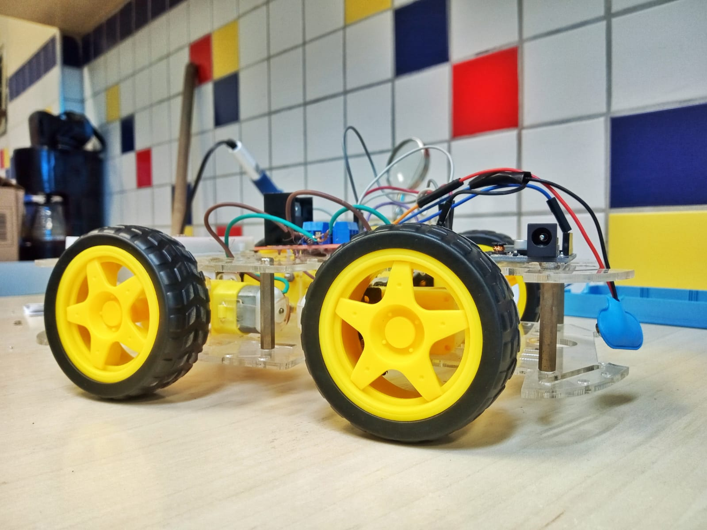

# AutoAgro
Um Robô Automático Aplicado Em Plantações e Hortas

> Um Robô Automático Aplicado Em Plantações e Hortas. Essa é uma solução barata e simples, não só para usar em hortas e jardins da população geral, como em pequenos sistemas agricolas.

### Progresso de Desenvolvimento

O projeto ainda está em desenvolvimento e as próximas atualizações serão voltadas nas seguintes tarefas:

- [x] Fazer Protótipo Inicial do Robô
- [ ] Controlar Robô Remotamente
- [ ] Design e Criação da Estrutura do Robô em 3d
- [ ] Impressão em Impressora 3d
- [ ] Sistema de Regador
- [ ] Extras...
- [ ] Teste de Campo

### Diário de Bordo
- 31/03/2023 -> O PROTÓTIPO FOI MONTADO E OS MOTORES FUNCIONARAM AO SEREM CONTROLADOS PELA WEMOS

### Estrutura
- WeMos(Esp8266) -> Barato, Potente e com WIFI Integrado; Controla o Circuito do Robô
- Ponte H -> Para Controlar a Alimentação dos Motores
- 4 Motores 5v
- Bateria 9v -> Alimentação da Ponte H | Arduino

## 🤝 Colaboradores

Conheça a Equipe que Desenvolve o Projeto:

<table>
  <tr>
    <td align="center">
      <a href="#">
         
        
          <b>André Luís</b>
        
      </a>
    </td>
    <td align="center">
      <a href="#">
         
        
          <b>Guilherme Daniel</b>
        
      </a>
    </td>
  </tr>
</table>

## 📝 Licença

Esse projeto está sob licença. Veja o arquivo [LICENÇA](LICENSE.md) para mais detalhes.

[⬆ Voltar ao topo](#nome-do-projeto) 
